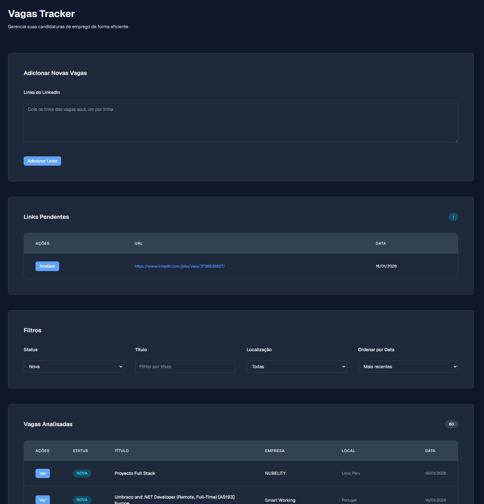

**Vagas Tracker**



Short description

Vagas Tracker is a lightweight job application tracker built with Next.js. It helps you collect LinkedIn job links, parse job details (company, title, location, seniority, type, posted date) and manage your applications with statuses and notes.

Key features

- Paste multiple LinkedIn job links (one per line) to queue them for analysis
- Parses job information using server-side HTML parsing
- Stores parsed job entries via Prisma (SQLite by default)
- Filtering, pagination and status management for tracked jobs

Technologies

- Next.js 16 (App Router)
- React 19 + TypeScript
- Tailwind CSS
- Prisma (SQLite by default) and `@prisma/client`
- Cheerio for HTML parsing
- Zod for input validation

Quickstart (local development)

1. Clone the repository:

   ```bash
   git clone https://github.com/your-username/vagas-tracker.git
   cd vagas-tracker
   ```

2. Install dependencies:

   ```bash
   npm install
   ```

3. Generate Prisma client and apply migrations (the repo includes migrations):

   ```bash
   npx prisma generate
   npx prisma migrate dev
   ```

   If you prefer to use an existing database or a different provider, set `DATABASE_URL` in your environment. See `prisma/schema.prisma`.

4. Run the development server:

   ```bash
   npm run dev
   ```

   The app runs on port `3001` by default (see `package.json`). Open http://localhost:3001

Production build

```bash
npm run build
npm run start
```

Basic usage

- Open the app in your browser.
- Paste LinkedIn job links into the "Add Links" textarea (one per line) and submit.
- Click "Analyze" on submitted links to parse and import job data.
- Use filters and pagination to browse jobs; select a job to add notes or update its status.

Project structure (high level)

- `src/app` — Next.js App Router pages and API routes
- `src/components` — UI components (cards, tables, inputs)
- `src/lib` — helper libraries (e.g. `jobParser.ts` for LinkedIn parsing)
- `prisma` — Prisma schema and migrations
- `public` — static assets (includes `readme.png`)

Contributing

Contributions are welcome. Suggested workflow:

1. Fork the repository and create a feature branch: `git checkout -b feat/my-change`
2. Implement your changes and keep commits focused and atomic
3. Run linting/tests (if added) and ensure the app runs locally
4. Open a Pull Request describing the change and rationale

Please follow these guidelines:

- Keep changes small and focused
- Write clear commit messages and PR descriptions
- Add tests for critical logic when possible

License

This project is provided under the MIT License. See the `LICENSE` file (or add one) for details.

Contact & links

- Open an issue or PR on GitHub for bugs, feature requests or questions.
- Useful links:
  - Next.js: https://nextjs.org
  - Prisma: https://www.prisma.io
  - Cheerio: https://cheerio.js.org

Challenges & ideas for contributors

- Add authentication (user accounts) and per-user job lists
- Move parsing into background workers / queues for large batches
- Add support for more job boards (Indeed, Glassdoor, company sites)
- Provide a REST or GraphQL API for integrations
- Add Dockerfile and CI (GitHub Actions) for reproducible builds

If you'd like, I can also help draft a `CONTRIBUTING.md`, add a `LICENSE` file, or create a minimal Dockerfile for development.
This is a [Next.js](https://nextjs.org) project bootstrapped with [`create-next-app`](https://nextjs.org/docs/app/api-reference/cli/create-next-app).

## Getting Started

First, run the development server:

```bash
npm run dev
# or
yarn dev
# or
pnpm dev
# or
bun dev
```

Open [http://localhost:3000](http://localhost:3000) with your browser to see the result.

You can start editing the page by modifying `app/page.tsx`. The page auto-updates as you edit the file.

This project uses [`next/font`](https://nextjs.org/docs/app/building-your-application/optimizing/fonts) to automatically optimize and load [Geist](https://vercel.com/font), a new font family for Vercel.

## Learn More

To learn more about Next.js, take a look at the following resources:

- [Next.js Documentation](https://nextjs.org/docs) - learn about Next.js features and API.
- [Learn Next.js](https://nextjs.org/learn) - an interactive Next.js tutorial.

You can check out [the Next.js GitHub repository](https://github.com/vercel/next.js) - your feedback and contributions are welcome!

## Deploy on Vercel

The easiest way to deploy your Next.js app is to use the [Vercel Platform](https://vercel.com/new?utm_medium=default-template&filter=next.js&utm_source=create-next-app&utm_campaign=create-next-app-readme) from the creators of Next.js.

Check out our [Next.js deployment documentation](https://nextjs.org/docs/app/building-your-application/deploying) for more details.
